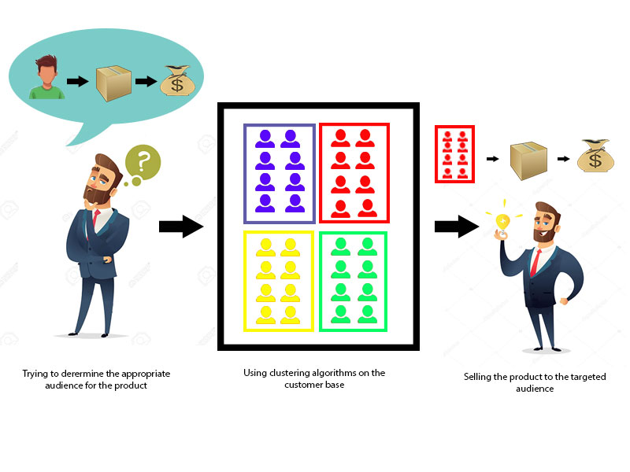

 
  

<h1 align="center"> Online_Retail_Customer_Segmentation </h1>

## Abstract:
Customer segmentation plays a key role in making business decisions. In the competitive field of e-commerce, it is very important to satisfy the customer needs and to identify the potential customer and these things should be done at the right time in the right manner. In this project, various segments
of customer segmentation are discussed and different techniques in customer segmentation are presented.

## Problem Statement:

In this project, The task is to identify major customer segments on a transnational data set which
contains all the transactions occurring between 01/12/2010 and 09/12/2011 for a UK-based and registered non-store online retail. The company mainly sells unique all-occasion gifts. Many customers of the company are wholesalers.

## Attribute Information:

**InvoiceNo**: Invoice number. A 6-digit integral number is uniquely assigned to each transaction. If this code starts with the letter 'c', it indicates a cancellation.

**StockCode**: Product (item) code. A 5-digit integral number is uniquely assigned to each distinct product.

**Description**: Product (item) name.

**Quantity**: The quantities of each product (item) per transaction.

**InvoiceDate**: Invoice Date and time. The day and time when each transaction was generated.

**UnitPrice**: Unit price. Product price per unit in sterling.

**CustomerID**: Customer number. A 5-digit integral number is uniquely assigned to each customer.

**Country**: Country name. The name of the country where each customer resides.

